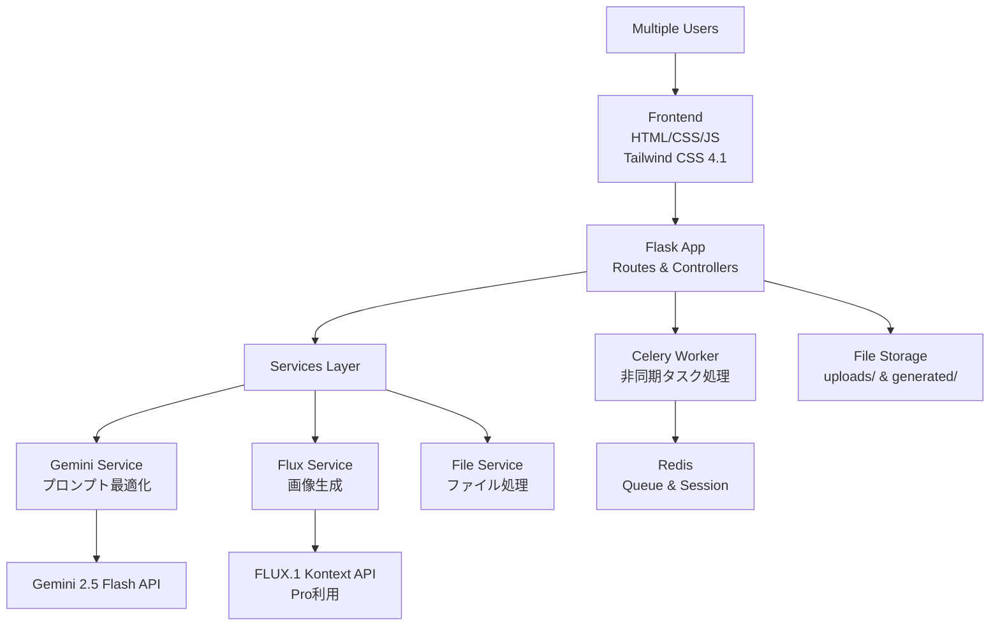

# 🎨 Hair Style AI Generator

**美容室のためのAIヘアスタイル再現ツール**

最新のFLUX.1 Kontext AIを活用して、美容室のWebサイト用モデル画像のヘアカット・ヘアカラーを瞬時に変更する商用レベルのWebアプリケーション。

[](https://python.org)
[](https://flask.palletsprojects.com/)
[](LICENSE)
[](https://blackforestlabs.ai/)

## 📋 概要

### 🎯 主要機能

- **🤖 AI画像生成**: FLUX.1 Kontext Proによる高品質ヘアスタイル変更
- **🌐 日本語対応**: Gemini 2.5 Flash Preview 05-20による自然な日本語プロンプト最適化
- **👥 マルチユーザー**: 複数美容師の同時利用対応
- **⚡ リアルタイム**: Socket.IOによる生成進捗のリアルタイム表示
- **📱 レスポンシブ**: Tailwind CSS 4.1による美しいモダンUI
- **🔐 商用対応**: レート制限・セキュリティ・セッション管理

### ✨ 技術的優位性

- **最新AI技術**: 2025年5月29日リリースのFLUX.1 Kontextで人物の顔・表情一貫性を保持
- **高速処理**: thinking_budget=0設定により最大8倍の高速プロンプト最適化
- **商用スケール**: 1日200枚の生成量、マルチユーザー同時処理対応
- **拡張可能設計**: 将来の機能追加を見据えたモジュラー構造

## 🚀 クイックスタート

### 前提条件

- Python 3.12+
- Redis Server
- Docker & Docker Compose（推奨）

### 🔑 APIキーの取得

1. **Gemini API**: [Google AI Studio](https://makersuite.google.com/app/apikey)でAPIキーを取得
2. **FLUX.1 API**: [Black Forest Labs](https://api.bfl.ml/)でAPIキーを取得

### ⚡ 5分セットアップ

```bash
# 1. リポジトリをクローン
git clone https://github.com/your-repo/hair-style-ai-generator.git
cd hair-style-ai-generator

# 2. 環境変数設定
cp env.example .env
# .envファイルを編集してAPIキーを設定

# 3. Docker Composeで起動
docker-compose up -d

# アプリケーションにアクセス
open http://localhost:5000
```

### 🐍 ローカル開発環境

```bash
# 仮想環境作成
python3.12 -m venv .venv
source .venv/bin/activate  # Windows: .venv\Scripts\activate

# 依存関係インストール
pip install -r requirements.txt

# Redis起動（別ターミナル）
redis-server

# Celeryワーカー起動（別ターミナル）
celery -A app.celery worker --loglevel=info

# アプリケーション起動（推奨: SocketIOサーバー使用）
python dev-start.py

# または通常の起動方法
python run.py
```

## 🔧 設定

### 環境変数

`.env`ファイルで以下を設定：

```bash
# === 必須設定 ===
GEMINI_API_KEY=your_gemini_api_key_here
BFL_API_KEY=your_bfl_api_key_here
SECRET_KEY=your_secret_key_here

# === Redis設定 ===
REDIS_URL=redis://localhost:6379/0

# === 制限設定 ===
RATE_LIMIT_PER_DAY=200          # 1日あたりの生成制限
USER_DAILY_LIMIT=50             # ユーザーあたりの日次制限
MAX_CONCURRENT_GENERATIONS=5    # 同時生成数制限

# === ファイル設定 ===
MAX_CONTENT_LENGTH=10485760     # 最大ファイルサイズ（10MB）
UPLOAD_FOLDER=app/static/uploads
GENERATED_FOLDER=app/static/generated
```

### 商用運用設定

```bash
# 本番環境用
FLASK_ENV=production
FLASK_DEBUG=False

# セキュリティ強化
SESSION_COOKIE_SECURE=True
SESSION_COOKIE_HTTPONLY=True
SESSION_COOKIE_SAMESITE=Lax
```

## 🏗 アーキテクチャ

### システム構成



### ディレクトリ構造

```
hair-style-ai-generator/
├── 📁 app/                     # メインアプリケーション
│   ├── 📁 routes/              # URLルーティング
│   ├── 📁 services/            # ビジネスロジック
│   ├── 📁 static/              # 静的ファイル
│   ├── 📁 templates/           # HTMLテンプレート
│   └── 📁 utils/               # ユーティリティ
├── 📁 docker/                  # Docker設定
├── 📁 tests/                   # テストスイート
├── 📁 docs/                    # ドキュメント
├── 📄 requirements.txt         # Python依存関係
├── 📄 run.py                   # アプリケーションエントリーポイント
└── 📄 docker-compose.yml       # Docker Compose設定
```

## 🔌 API仕様

### 主要エンドポイント

| エンドポイント | メソッド | 説明 | レート制限 |
|---------------|---------|------|-----------|
| `/api/health` | GET | ヘルスチェック | - |
| `/api/info` | GET | システム情報 | 50/時間 |
| `/api/session` | GET/POST/DELETE | セッション管理 | 100/時間 |
| `/upload` | POST | 画像アップロード | 20/時間 |
| `/generate` | POST | 画像生成開始 | 10/時間 |
| `/api/stats` | GET | 統計情報 | 20/時間 |

### リクエスト例

```bash
# 画像アップロード
curl -X POST \
  -F "file=@sample.jpg" \
  http://localhost:5000/upload

# 画像生成
curl -X POST \
  -H "Content-Type: application/json" \
  -d '{"prompt": "ショートボブに変更してください", "image_id": "12345"}' \
  http://localhost:5000/generate
```

### WebSocket イベント

```javascript
// Socket.IO接続
const socket = io();

// 進捗受信
socket.on('generation_progress', (data) => {
    console.log(`進捗: ${data.status}`);
});

// 完了通知
socket.on('generation_complete', (data) => {
    console.log('生成完了:', data.result_url);
});
```

## 📊 パフォーマンス

### 処理時間目安

| 処理 | 平均時間 | 最大時間 |
|------|---------|---------|
| プロンプト最適化 | 2-5秒 | 10秒 |
| 画像生成（FLUX.1） | 60-180秒 | 300秒 |
| 画像ダウンロード | 5-15秒 | 30秒 |

### 制限事項

- **画像サイズ**: 最大10MB
- **対応形式**: JPG, PNG, WebP
- **プロンプト**: 512トークン以内
- **同時処理**: 5タスクまで
- **日次制限**: ユーザーあたり50枚

## 🧪 テスト

### テスト実行

```bash
# 全テスト実行
pytest

# カバレッジ付きテスト
pytest --cov=app --cov-report=html

# 特定テスト実行
pytest tests/test_services/

# 負荷テスト
locust -f tests/test_load/locustfile.py
```

### テスト構成

- **単体テスト**: 各サービス・ユーティリティ
- **統合テスト**: API・ワークフロー
- **負荷テスト**: 同時接続・パフォーマンス

## 🚢 デプロイメント

### Docker Compose（推奨）

```bash
# 本番環境デプロイ
docker-compose -f docker-compose.yml up -d

# サービス確認
docker-compose ps

# ログ確認
docker-compose logs -f web
```

### 手動デプロイ

```bash
# 本番用設定
export FLASK_ENV=production
export REDIS_URL=redis://your-redis-server:6379/0

# Gunicorn起動
gunicorn --worker-class eventlet -w 4 --bind 0.0.0.0:5000 run:app

# Celeryワーカー起動
celery -A app.celery worker --loglevel=info --concurrency=4
```

### 環境要件

| 環境 | CPU | メモリ | ストレージ |
|------|-----|--------|-----------|
| 開発 | 2コア | 4GB | 10GB |
| 本番 | 4コア | 8GB | 50GB |
| 大規模 | 8コア | 16GB | 100GB |

## 📈 監視・運用

### ヘルスチェック

```bash
# アプリケーション状態確認
curl http://localhost:5000/api/health

# Redis接続確認
redis-cli ping

# Celeryワーカー確認
celery -A app.celery inspect ping
```

### ログ管理

```bash
# アプリケーションログ
tail -f hair_style_generator.log

# Dockerログ
docker-compose logs -f

# 特定サービスログ
docker-compose logs -f web worker
```

### 統計・分析

- リアルタイム統計: `/api/stats`
- 日次レポート: ログファイル分析
- パフォーマンス監視: Prometheus連携（オプション）

## 🔒 セキュリティ

### 実装済み対策

- **CSRF保護**: Flask-WTF
- **レート制限**: Flask-Limiter
- **入力検証**: ファイル形式・サイズチェック
- **セッション管理**: Redis基盤の安全なセッション
- **API認証**: セッションベース認証

### 追加推奨対策

```bash
# HTTPS化（本番環境）
# SSL証明書設定
# Nginxリバースプロキシ
# ファイアウォール設定
```

## 🤝 開発・貢献

### 開発環境セットアップ

```bash
# 開発依存関係インストール
pip install -r requirements-dev.txt

# Pre-commit hooks設定
pre-commit install

# テスト環境起動
docker-compose -f docker-compose.test.yml up -d
```

### コーディング規約

- **Python**: PEP 8準拠
- **JavaScript**: ES6+使用
- **CSS**: Tailwind CSS設計システム
- **コミット**: Conventional Commits形式

### Issue・PR

1. Issueで議論・提案
2. Forkして開発
3. テスト追加・実行
4. Pull Request作成

## 💰 コスト試算

### API利用料金

| サービス | 単価 | 月間想定 | 月額コスト |
|---------|------|---------|-----------|
| FLUX.1 Kontext | $0.06-0.08/画像 | 6,000画像 | $420 |
| Gemini 2.5 Flash | 無料枠 | - | $0 |
| **合計** | - | - | **$420/月** |

### インフラコスト

| 項目 | 月額 |
|------|------|
| VPS (4コア/8GB) | $50-100 |
| Redis Cloud | $0-30 |
| CDN | $20-50 |
| **合計** | **$70-180/月** |

## 📚 関連ドキュメント

- [📖 完全要件定義書](docs/requirements.md)
- [🔧 API詳細仕様](docs/api.md)
- [🏗 アーキテクチャガイド](docs/architecture.md)
- [🚀 デプロイメントガイド](docs/deployment.md)
- [🧪 テストガイド](docs/testing.md)

## 📄 ライセンス

このプロジェクトは商用ライセンスの下で提供されています。詳細は[LICENSE](LICENSE)ファイルをご確認ください。

## 🆘 サポート

### バグ報告・機能要望

- [GitHub Issues](https://github.com/your-repo/hair-style-ai-generator/issues)
- [Discussions](https://github.com/your-repo/hair-style-ai-generator/discussions)

### 技術サポート

- 📧 Email: support@your-domain.com
- 💬 Slack: #hair-style-ai-support
- 📞 電話: 03-XXXX-XXXX（平日10:00-18:00）

### よくある質問

**Q: APIキーはどこで取得できますか？**
A: [Google AI Studio](https://makersuite.google.com/app/apikey)（Gemini）と[Black Forest Labs](https://api.bfl.ml/)（FLUX.1）で取得できます。

**Q: 1日の生成制限を変更できますか？**
A: `.env`ファイルの`USER_DAILY_LIMIT`を変更してください。

**Q: 商用利用は可能ですか？**
A: はい、商用利用を前提として設計されています。ライセンス条項をご確認ください。

---

<div align="center">

**🎨 Hair Style AI Generator**

*美容室の未来を、AIと共に*

[🚀 今すぐ始める](#クイックスタート) • [📖 ドキュメント](docs/) • [💬 サポート](#サポート)

</div> 