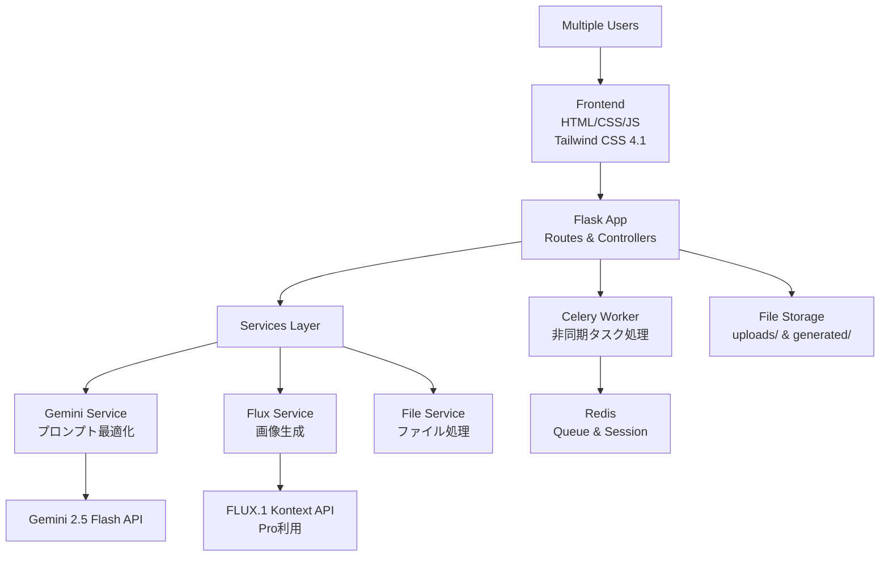

# 美容室ヘアスタイル再現アプリ 完全要件定義書 (MVP版)

## 📋 プロジェクト概要

### 1.1 プロジェクト名

**Hair Style AI Generator** - 美容室のためのAIヘアスタイル再現ツール

### 1.2 目的

美容室のWebサイトに掲載するモデル画像を、最新のFLUX.1 Kontext AIを活用してヘアカット・ヘアカラーに変更し、魅力的なビジュアルコンテンツを効率的に作成する。

### 1.3 開発方針

- **MVP重視**：核心機能に集中した迅速な実装
- **商用利用対応**：1日200枚の生成量に対応
- **マルチユーザー対応**：複数美容師の同時利用
- **拡張可能設計**：将来の機能追加を見据えた構造

### 1.4 技術的優位性

- FLUX.1 Kontextは2025年5月29日リリースの最新技術で、人物の顔・表情の一貫性保持に特化し、最大8倍の高速処理を実現

## 🎯 機能要件

### 2.1 コア機能（必須実装）

### 2.1.1 画像入力

ユーザーは、ヘアスタイル変更の元となる画像を以下のいずれかの方法で指定できる。

1.  **ファイルアップロード**
    *   ユーザーはローカルデバイスから画像ファイル（JPG, PNG, WebP形式）をアップロードできる。
    *   ドラッグ＆ドロップおよびファイル選択ダイアログの両方に対応する。
    *   アップロードされた画像はプレビュー表示され、ユーザーは変更対象の画像を確認できる。
    *   ファイルサイズは最大10MBまでとする。

2.  **URL指定による画像取得**
    *   ユーザーはHotPepperBeautyのスタイル詳細ページのURLを直接入力できる。
    *   入力されたURLから、アプリケーションが自動的にメインのスタイル画像を抽出（スクレイピング）する。
    *   抽出された画像は高画質化（URLクエリパラメータの削除）された後、プレビュー表示される。
    *   URLの不正、画像の取得失敗など、エラー時には適切なフィードバックをユーザーに表示する。

### 2.1.2 プロンプト最適化エンジン

```python
# 実装仕様例
def optimize_hair_style_prompt(japanese_input, image_analysis):
    """
    日本語指示をFLUX.1 Kontext最適プロンプトに変換

    入力例: "ショートボブで茶色の髪に変更してください"
    出力例: "Transform the woman with long black hair to have a short bob cut,
            change hair color to warm brown, maintain identical facial features,
            expression, and composition, keep the same lighting and background"
    """

    system_prompt = """
    あなたは美容室のヘアスタイル変更プロンプト最適化の専門家です。
    日本語の指示をFLUX.1 Kontextで最適な英語プロンプトに変換してください。

    変換ルール:
    1. 人物の顔・表情の一貫性保持を必須で含める
    2. 具体的なヘアスタイル名称を使用
    3. 背景・構図・照明の保持を指示
    4. 512トークン以内で簡潔に
    5. "maintain identical" "keep the same"を活用
    """

    full_prompt = f"""
    {system_prompt}

    日本語指示: {japanese_input}
    画像の特徴: {image_analysis}

    最適化された英語プロンプト:
    """

    # Gemini 2.5 Flash でプロンプト最適化
    from google import genai
    from google.genai.types import GenerateContentConfig, ThinkingConfig
    
    client = genai.Client(api_key=os.getenv('GEMINI_API_KEY'))
    
    response = client.models.generate_content(
        model="gemini-2.5-flash",
        contents=full_prompt,
        config=GenerateContentConfig(
            thinking_config=ThinkingConfig(
                thinking_budget=0  # 速度重視
            ),
            temperature=0.3,
            top_p=0.8,
            max_output_tokens=512
        )
    )
    
    return response.text
```

### 2.1.3 AI画像生成システム

```python
# FLUX.1 Kontext API統合仕様（確実な情報）
class FluxKontextService:
    def __init__(self):
        self.api_key = os.getenv('BFL_API_KEY')
        self.base_url = "https://api.us1.bfl.ai/v1"

    def generate_hair_style(self, image_base64, optimized_prompt):
        """
        ヘアスタイル画像生成

        Parameters:
        - image_base64: 元画像（base64エンコード）
        - optimized_prompt: 最適化されたプロンプト（512トークン以内）

        Returns:
        - task_id: 非同期処理用ID
        """

        endpoint = f"{self.base_url}/flux-kontext-pro"

        payload = {
            "prompt": optimized_prompt,
            "input_image": image_base64,
            "seed": None,  # 再現性のため必要に応じて設定
            "safety_tolerance": 2,  # 0=厳格、6=寛容（デフォルト2）
            "output_format": "jpeg",  # "jpeg" または "png"
            "webhook_url": None,  # 非同期通知用（オプション）
            "webhook_secret": None  # Webhook認証用（オプション）
        }

        headers = {
            "accept": "application/json",
            "x-key": self.api_key,
            "Content-Type": "application/json"
        }

        response = requests.post(endpoint, headers=headers, json=payload)
        
        if response.status_code == 200:
            return response.json()["id"]
        else:
            raise Exception(f"API Error: {response.status_code} - {response.text}")

    def get_result(self, task_id):
        """
        結果取得（ポーリング用）
        
        Returns:
        - status: "Processing", "Queued", "Ready", "Error", "Content Moderated"
        - result: 成功時は画像URLを含む
        """
        url = f"{self.base_url}/get_result"
        headers = {"accept": "application/json", "x-key": self.api_key}
        params = {"id": task_id}

        response = requests.get(url, headers=headers, params=params)
        
        if response.status_code == 200:
            result = response.json()
            # 署名付きURLは10分間のみ有効
            return result
        else:
            raise Exception(f"API Error: {response.status_code} - {response.text}")

    def poll_until_ready(self, task_id, max_wait_time=300):
        """
        結果が準備できるまでポーリング
        
        Parameters:
        - task_id: タスクID
        - max_wait_time: 最大待機時間（秒）
        
        Returns:
        - 画像URL（成功時）
        """
        import time
        start_time = time.time()
        
        while time.time() - start_time < max_wait_time:
            result = self.get_result(task_id)
            status = result.get("status")
            
            if status == "Ready":
                # 署名付きURLは10分以内に取得する必要がある
                return result["result"]["sample"]
            elif status in ["Error", "Content Moderated", "Request Moderated"]:
                raise Exception(f"Generation failed: {status}")
            
            # 1.5秒待機してから再試行
            time.sleep(1.5)
        
        raise Exception("Timeout: Image generation took too long")
```

### 2.2 ユーザー管理システム（マルチユーザー対応）

```python
# セッション管理仕様
class UserSessionManager:
    def __init__(self):
        self.redis_client = redis.Redis.from_url(os.getenv('REDIS_URL'))

    def create_session(self, user_name):
        """ユーザーセッション作成"""
        session_id = str(uuid.uuid4())
        session_data = {
            "user_name": user_name,
            "created_at": datetime.utcnow().isoformat(),
            "uploaded_images": [],
            "generated_images": [],
            "active_tasks": []
        }

        # 24時間有効なセッション
        self.redis_client.setex(
            f"session:{session_id}",
            86400,
            json.dumps(session_data)
        )

        return session_id
```

## 🔧 技術仕様

### 3.1 技術スタック

```yaml
バックエンド:
  - Python: 3.12.x
  - Flask: 3.0+
  - Flask-SocketIO: 5.3.6 (リアルタイム通信)
  - Celery: 5.3.6 (非同期タスク処理)
  - Redis: 5.0.1 (タスクキュー・セッション管理)
  - Pillow: 10.0.1 (画像処理)

フロントエンド:
  - HTML5 + CSS3 + JavaScript (ES6+)
  - Tailwind CSS 4.1+ (最新版レスポンシブUI)
  - Socket.IO Client (進捗表示)
  - Axios (HTTP通信)

API統合:
  - google-genai: 1.0+ (Gemini 2.5 Flash)
  - requests: 2.31.0 (FLUX.1 Kontext API)
```

### 3.2 API統合仕様（最新情報反映）

### 3.2.1 Gemini 2.5 Flash統合

Gemini 2.5 Flash はプロンプト最適化に最適な最新モデル

```python
# Gemini 2.5 Flash 設定
from google import genai
from google.genai.types import GenerateContentConfig, ThinkingConfig

client = genai.Client(api_key=os.getenv('GEMINI_API_KEY'))

def optimize_prompt_with_gemini(prompt):
    """
    Gemini 2.5 Flash でプロンプト最適化
    速度重視のため thinking_budget=0 に設定
    """
    response = client.models.generate_content(
        model="gemini-2.5-flash",
        contents=prompt,
        config=GenerateContentConfig(
            thinking_config=ThinkingConfig(
                thinking_budget=0  # 速度重視のため思考機能無効化
            ),
            temperature=0.3,
            top_p=0.8,
            max_output_tokens=512
        )
    )
    return response.text
```

### 3.2.2 FLUX.1 Kontext統合

BFL APIの**flux-kontext-pro**エンドポイントの正確な仕様

```python
# 正確なFLUX.1 Kontext Pro API仕様
endpoint = "https://api.us1.bfl.ai/v1/flux-kontext-pro"

# 必須パラメータ
required_params = {
    "prompt": "編集指示（512トークン以内）",
    "input_image": "base64エンコード画像"
}

# オプションパラメータ
optional_params = {
    "seed": None,  # 再現性用（整数）
    "safety_tolerance": 2,  # 0-6（0=厳格、6=寛容）
    "output_format": "jpeg",  # "jpeg" or "png"
    "webhook_url": None,  # 非同期通知URL
    "webhook_secret": None  # Webhook認証
}

# レスポンス仕様
response_structure = {
    "id": "task_id",  # ポーリング用ID
    "status": "Queued"  # 初期ステータス
}

# 結果取得API
get_result_endpoint = "https://api.us1.bfl.ai/v1/get_result"
get_result_params = {"id": "task_id"}

# 可能なステータス
statuses = [
    "Processing",  # 処理中
    "Queued",     # キュー待ち
    "Ready",      # 完了
    "Error",      # エラー
    "Content Moderated",  # コンテンツ制限
    "Request Moderated"   # リクエスト制限
]

# 重要な制限事項
limitations = {
    "prompt_max_tokens": 512,  # プロンプト最大トークン数
    "signed_url_validity": "10分",  # 署名付きURL有効期限
    "polling_interval": 1.5,  # 推奨ポーリング間隔（秒）
    "max_wait_time": 300  # 推奨最大待機時間（秒）
}
```

### 3.3 システム構成図



### 3.4 ディレクトリ構造

```
hpb-style-ai-generator/
├── app/
│   ├── __init__.py
│   ├── config.py
│   ├── routes/              # URLルーティング
│   │   ├── api.py
│   │   ├── generate.py
│   │   ├── main.py
│   │   └── upload.py
│   ├── services/            # ビジネスロジック
│   │   ├── file_service.py
│   │   ├── flux_service.py
│   │   ├── gemini_service.py
│   │   ├── scraping_service.py
│   │   ├── session_service.py
│   │   └── task_service.py
│   ├── static/              # 静的ファイル
│   │   ├── 📁 js/                # JavaScriptファイル
│   │   │   ├── generate.js       # (画像生成ページのロジック)
│   │   │   ├── session-recovery.js # (セッション復帰処理)
│   │   │   └── upload.js         # (アップロード処理)
│   │   ├── 📁 uploads/           # ユーザーがアップロードした画像
│   │   └── 📁 generated/         # AIが生成した画像
│   ├── templates/           # HTMLテンプレート
│   │   ├── base.html
│   │   ├── index.html
│   │   ├── gallery.html
│   │   └── about.html
│   └── utils/
│       ├── __init__.py
│       └── decorators.py
├── tests/
│   ├── conftest.py
│   ├── test_load/
│   ├── test_routes/
│   └── test_services/
├── docker/
│   ├── Dockerfile
│   ├── docker-compose.yml
│   └── nginx.conf.example
├── docs/
│   └── requirements.md
├── logs/                  # ログファイル
├── .env.example
├── requirements.txt
├── run.py
└── README.md
```

### 3.5 Celery + Flask-SocketIO 統合仕様

```python
# Flask-SocketIOとCeleryの正しい統合
import eventlet
eventlet.monkey_patch(all=False, socket=True)

from flask import Flask
from flask_socketio import SocketIO
from celery import Celery

def create_celery_app(app=None):
    app = app or create_app()
    
    class FlaskTask(Task):
        def __call__(self, *args, **kwargs):
            with app.app_context():
                return self.run(*args, **kwargs)
    
    celery = Celery(app.import_name, task_cls=FlaskTask)
    celery.conf.update(app.config.get("CELERY_CONFIG", {}))
    celery.set_default()
    app.extensions["celery"] = celery
    return celery

# SocketIO外部プロセス用設定
def create_external_socketio():
    """Celeryワーカーからの通信用"""
    return SocketIO(message_queue=os.getenv('REDIS_URL'))
```

## 📅 開発スケジュール

### Phase 1: 基盤構築

```bash
# 実装項目
□ Flask アプリケーション初期化
□ Tailwind CSS 4.1 + 基本UIテンプレート
□ ファイルアップロード機能実装
□ Redis + Celery セットアップ
□ 環境変数設定（.env）
□ Docker化準備

# 技術検証
□ Gemini 2.5 Flash API接続テスト（thinking_budget=0）
□ FLUX.1 Kontext API接続テスト
□ 画像処理フロー確認
```

### Phase 2: AI統合

```bash
# API統合
□ Gemini Service実装
□ プロンプト最適化ロジック実装
□ Flux Service実装
□ 非同期タスク処理実装
□ エラーハンドリング強化

# 機能実装
□ 画像アップロード → プロンプト最適化フロー
□ 最適化 → 画像生成フロー
□ 結果取得 → 表示フロー
```

### Phase 3: UI/UX完成

```bash
# フロントエンド
□ リアルタイム進捗表示（Socket.IO）
□ 画像ギャラリー機能
□ Before/After比較表示
□ ダウンロード機能
□ ユーザーセッション管理UI

# マルチユーザー対応
□ ユーザー識別システム
□ 同時処理制御
□ セッション永続化
```

### Phase 4: テスト・最適化

```bash
# テスト実装
□ 単体テスト（pytest）
□ 統合テスト（Flask-Testing）
□ API制限テスト
□ 同時接続テスト（Locust）

# 本番準備
□ パフォーマンス最適化
□ セキュリティ強化
□ デプロイ環境構築
□ ドキュメント作成
```

## 🔐 セキュリティ・認証要件

### 5.1 基本セキュリティ

```python
# CSRF保護
from flask_wtf.csrf import CSRFProtect
csrf = CSRFProtect(app)

# ファイルアップロード検証
ALLOWED_EXTENSIONS = {'png', 'jpg', 'jpeg', 'webp'}
MAX_CONTENT_LENGTH = 10 * 1024 * 1024  # 10MB

def allowed_file(filename):
    return '.' in filename and \
           filename.rsplit('.', 1)[1].lower() in ALLOWED_EXTENSIONS

# APIキー管理
def get_api_keys():
    return {
        'gemini': os.getenv('GEMINI_API_KEY'),
        'bfl': os.getenv('BFL_API_KEY')
    }
```

### 5.2 レート制限

```python
from flask_limiter import Limiter
from flask_limiter.util import get_remote_address

limiter = Limiter(
    app,
    key_func=get_remote_address,
    default_limits=["200 per day", "50 per hour"]
)

@app.route('/api/generate')
@limiter.limit("10 per minute")
def generate_image():
    pass
```

## 🧪 テスト戦略

### 6.1 テスト構造

```python
# pytest設定例
# tests/conftest.py
import pytest
from app import create_app
from app.config import TestingConfig

@pytest.fixture
def app():
    app = create_app(TestingConfig)
    return app

@pytest.fixture
def client(app):
    return app.test_client()

# APIテスト例
# tests/test_services/test_gemini_service.py
def test_optimize_prompt():
    service = GeminiService()
    result = service.optimize_prompt(
        "ショートボブに変更",
        "woman with long black hair"
    )
    assert "short bob" in result.lower()
    assert "maintain" in result.lower()
```

### 6.2 負荷テスト

```python
# locustfile.py
from locust import HttpUser, task, between

class WebsiteUser(HttpUser):
    wait_time = between(1, 5)

    @task
    def upload_image(self):
        with open("test_image.jpg", "rb") as f:
            self.client.post("/upload", files={"image": f})

    @task(3)
    def view_gallery(self):
        self.client.get("/gallery")
```

## 📦 デプロイメント

### 7.1 Docker構成

```dockerfile
# Dockerfile
FROM python:3.12-slim

WORKDIR /app

COPY requirements.txt .
RUN pip install --no-cache-dir -r requirements.txt

COPY . .

EXPOSE 5000

CMD ["gunicorn", "--worker-class", "eventlet", "-w", "1", "--bind", "0.0.0.0:5000", "run:app"]
```

```yaml
# docker-compose.yml
version: '3.8'

services:
  web:
    build: .
    ports:
      - "5000:5000"
    environment:
      - REDIS_URL=redis://redis:6379/0
    depends_on:
      - redis
    volumes:
      - ./app/static/uploads:/app/app/static/uploads
      - ./app/static/generated:/app/app/static/generated

  worker:
    build: .
    command: celery -A run.celery_app worker --loglevel=info
    environment:
      - REDIS_URL=redis://redis:6379/0
    depends_on:
      - redis
    volumes:
      - ./app/static:/app/app/static

  redis:
    image: redis:7-alpine
    ports:
      - "6379:6379"

  nginx:
    image: nginx:alpine
    ports:
      - "80:80"
    volumes:
      - ./nginx.conf:/etc/nginx/nginx.conf
    depends_on:
      - web
```

## 🚀 実装開始準備

### 8.1 即座に実行すべき準備作業

```bash
# 1. APIキー取得
echo "1. Google AI StudioでGemini APIキー取得"
echo "2. Black Forest LabsでBFL APIキー取得"

# 2. 開発環境構築
python3.12 -m venv .venv
source .venv/bin/activate
pip install --upgrade pip

# 3. 必要パッケージインストール準備
cat > requirements.txt << 'EOF'
Flask==3.0.3
Flask-SocketIO==5.3.6
Celery==5.3.6
Redis==5.0.1
google-genai>=1.0.0
requests==2.31.0
Pillow==10.0.1
python-dotenv==1.0.0
Flask-WTF==1.2.1
Flask-Limiter==3.5.0
pytest==7.4.3
pytest-flask==1.3.0
gunicorn[eventlet]==21.2.0
locust==2.17.0
eventlet==0.35.2
kombu==5.3.5
EOF

# 4. 環境変数設定
cat > .env.example << 'EOF'
GEMINI_API_KEY=your_gemini_api_key_here
BFL_API_KEY=your_bfl_api_key_here
REDIS_URL=redis://localhost:6379/0
SECRET_KEY=your_secret_key_here
UPLOAD_FOLDER=app/static/uploads
GENERATED_FOLDER=app/static/generated
MAX_CONTENT_LENGTH=10485760
FLASK_ENV=development
EOF
```

## 📊 コスト試算

### 9.1 API利用コスト

```yaml
FLUX.1 Kontext [pro]: $0.06-0.08/画像
Gemini 2.5 Flash: 無料枠内で十分

月間想定コスト:
  - 200画像/日 × 30日 = 6,000画像/月
  - 6,000画像 × $0.07 = $420/月
  - 年間: $5,040
```

### 9.2 インフラコスト

```yaml
開発環境:
  - Redis: ローカル（無料）
  - Python環境: ローカル（無料）

本番環境（想定）:
  - VPS: $50-100/月
  - Redis Cloud: $0-30/月
  - CDN: $20-50/月
```

## 🔧 API統合の重要な仕様

### 10.1 FLUX.1 Kontext API制限事項

```python
# 重要な制限事項とベストプラクティス
API_CONSTRAINTS = {
    "prompt_max_tokens": 512,  # プロンプト最大長
    "supported_formats": ["JPG", "JPEG", "PNG", "WebP"],
    "input_image_encoding": "base64",
    "signed_url_validity": 600,  # 10分（秒）
    "polling_interval": 1.5,  # 推奨間隔（秒）
    "max_wait_time": 300,  # 推奨最大待機（秒）
    "rate_limits": "APIキー依存"
}

# エラーハンドリング
ERROR_HANDLING = {
    "Content Moderated": "入力画像が制限に引っかかった",
    "Request Moderated": "プロンプトが制限に引っかかった", 
    "Error": "生成エラー",
    "Task not found": "タスクIDが見つからない"
}

# プロンプト最適化のコツ
PROMPTING_BEST_PRACTICES = {
    "specificity": "具体的で明確な指示",
    "character_consistency": "maintain identical facial features",
    "preservation": "keep the same lighting and background",
    "text_editing": "Replace 'old text' with 'new text'",
    "style_transfer": "具体的なスタイル名を使用"
}
```

### 10.2 美容室向け最適化プロンプトテンプレート

```python
# 美容室専用プロンプトテンプレート
HAIRSTYLE_TEMPLATES = {
    "cut_change": "Change the hairstyle to {style_name} while maintaining identical facial features, expression, and skin tone. Keep the same lighting, background, and camera angle.",
    
    "color_change": "Change the hair color to {color_name} while keeping the exact same hairstyle, facial features, and expression. Maintain identical lighting and background.",
    
    "style_and_color": "Transform the hairstyle to {style_name} and change hair color to {color_name} while preserving identical facial features, expression, and composition.",
    
    "length_adjustment": "Adjust the hair length to {length_description} while maintaining the same style, facial features, and overall composition."
}

# 使用例
def create_hairstyle_prompt(change_type, **kwargs):
    template = HAIRSTYLE_TEMPLATES.get(change_type)
    if template:
        return template.format(**kwargs)
    return None
```

### 4.2. ソフトウェア

| カテゴリ | ソフトウェア | バージョン | 目的 |
|---|---|---|---|
| **言語** | Python | 3.12+ | バックエンド開発言語 |
| **フレームワーク** | Flask | 3.0+ | Webアプリケーションフレームワーク |
| **非同期処理** | Celery | 5.3+ | バックグラウンドタスク処理 |
| **メッセージキュー**| Redis | 5.0+ | Celeryのブローカー、セッションストレージ |
| **AI (プロンプト)** | google-genai | 1.0+ | Gemini API連携 |
| **HTTP通信** | requests | 2.31+ | 外部API連携 |
| **Webスクレイピング** | beautifulsoup4 | 4.12+ | HTMLパース、画像URL抽出 |
| **画像処理** | Pillow | 10.0+ | 画像のリサイズ、フォーマット変換 |
| **本番サーバー** | Gunicorn | 21.2+ | WSGIサーバー |
| **リアルタイム通信**| Flask-SocketIO | 5.3+ | WebSocket通信 |
| **テスト** | Pytest, Locust | - | 単体テスト、負荷テスト |

---

## 5. 性能要件

## 🧑‍💻 ユーザーストーリー追加
- 「髪型だけを変えたい」ユーザーのため、画像上で髪部分を手動でマスキングできるUIを提供
- 生成モード切替（マスクなし/あり）で用途に応じた使い分けが可能

## 🎨 UI/UX要件追加
- 画像上でブラシによる手動マスキング（髪部分のみ編集）
- ブラシサイズ調整、Undo、リセット機能
- スマホ・タブレットでも直感的に操作可能
- 生成モード切替UI（Kontext/Fill）
- Toastify等による即時通知UI

## 🛠️ 非機能要件追加
- ObjectURLの解放推奨（アップロード画像）
- 画像リサイズ時はcanvasも再調整
- エラー時はToastify等で即時通知

## 🔌 API仕様追加
- /generateエンドポイントでmode（kontext/fill）とmask_data（Base64 PNG）を受け付け、髪だけ編集する場合はFill APIを呼び出す

## 🧪 テスト要件追加
- マスキングUIの動作テスト（描画・Undo・リセット・スマホ対応）
- 画像アップロード・URL取得どちらでもマスキングできること
- 生成モード切替時の挙動テスト
